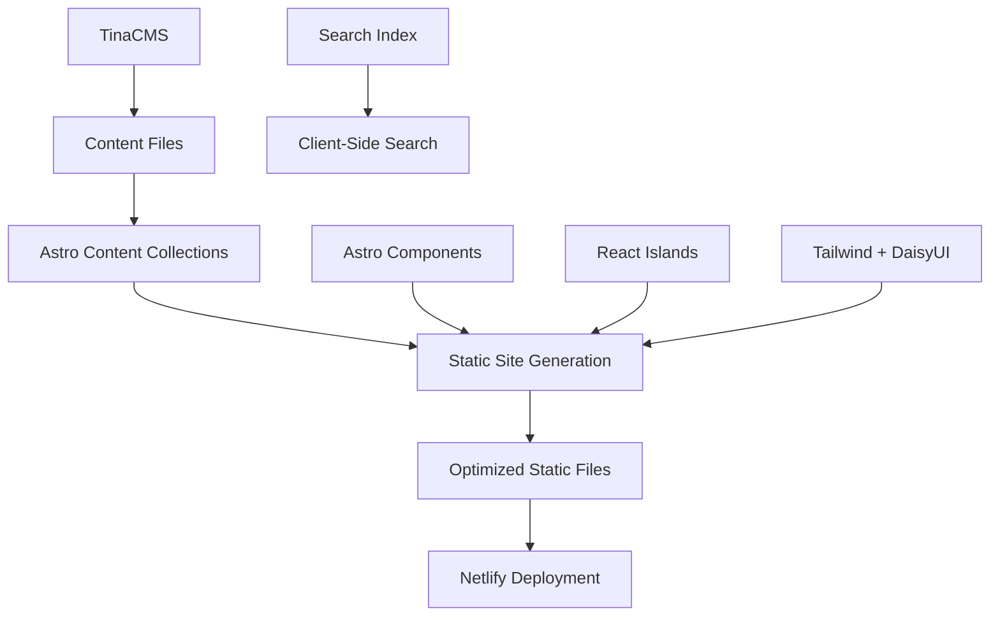

# Design Document

## Overview

This design outlines the migration strategy from Next.js to Astro.js for a content-focused blog. The migration leverages Astro's static-first architecture, content collections, and component islands to maintain all existing functionality while improving performance. The design preserves the current content structure, TinaCMS integration, and user experience while adopting Astro's modern development patterns.

## Architecture

### High-Level Architecture



### Content Architecture

- **Content Collections**: Migrate from Contentlayer to Astro's native content collections
- **File Structure**: Maintain existing `content/` directory structure
- **Frontmatter**: Preserve all existing frontmatter fields with type validation
- **URL Structure**: Maintain existing URL patterns through Astro's file-based routing

### Component Architecture

- **Astro Components**: Primary UI components using Astro's component syntax
- **React Islands**: Interactive components (search, theme switcher) as React islands
- **Layout System**: Hierarchical layouts for different content types
- **Styling**: Continue using Tailwind CSS with DaisyUI components

## Components and Interfaces

### Content Collections Schema

```typescript
// src/content/config.ts
const posts = defineCollection({
  type: 'content',
  schema: z.object({
    title: z.string(),
    date: z.date(),
    path: z.string().optional(),
    featuredImage: z.string().optional(),
    description: z.string().optional(),
    tags: z.array(z.string()).optional(),
  })
});

const pages = defineCollection({
  type: 'content',
  schema: z.object({
    title: z.string(),
    date: z.date(),
    path: z.string().optional(),
    description: z.string().optional(),
  })
});

const projects = defineCollection({
  type: 'content',
  schema: z.object({
    title: z.string(),
    date: z.date(),
    path: z.string().optional(),
    description: z.string().optional(),
    galleryImage: z.array(z.string()).optional(),
    techStack: z.array(z.string()).optional(),
    liveUrl: z.string().optional(),
    repoUrl: z.string().optional(),
  })
});
```

### Core Components

#### Layout Components
- `BaseLayout.astro` - Root layout with HTML structure, meta tags, and global styles
- `BlogLayout.astro` - Blog-specific layout with navigation and footer
- `PostLayout.astro` - Individual post layout with reading time and tags
- `ProjectLayout.astro` - Project-specific layout with gallery and tech stack

#### Content Components
- `PostCard.astro` - Post preview cards for listings
- `ProjectCard.astro` - Project preview cards
- `TagList.astro` - Tag display and navigation
- `Pagination.astro` - Page navigation component
- `TableOfContents.astro` - Auto-generated TOC from headings

#### Interactive Islands
- `SearchComponent.tsx` - Client-side search with Fuse.js
- `ThemeToggle.tsx` - Dark/light mode switcher
- `ImageGallery.tsx` - Project image gallery with lightbox

### Routing Structure

```
src/pages/
├── index.astro                    # Homepage
├── search.astro                   # Search page
├── posts/
│   ├── index.astro               # Posts listing
│   ├── page/[page].astro         # Paginated posts
│   ├── [year]/[month]/[slug].astro # Legacy post URLs
│   └── [...slug].astro           # Modern post URLs
├── tag/
│   ├── index.astro               # All tags
│   └── [tag].astro               # Posts by tag
├── by-date/
│   └── [year]/[month].astro      # Posts by date
├── content/
│   └── [...slug].astro           # Pages and projects
└── portafolio/
    └── [...slug].astro           # Portfolio pages
```

### URL Mapping Strategy

The migration maintains URL compatibility through:

1. **File-based routing** matching existing patterns
2. **Dynamic routes** for parameterized URLs
3. **Redirect configuration** in `astro.config.mjs` for legacy URLs
4. **Custom slug handling** preserving existing post paths

## Data Models

### Post Model
```typescript
interface Post {
  id: string;
  slug: string;
  body: string;
  collection: 'posts';
  data: {
    title: string;
    date: Date;
    path?: string;
    featuredImage?: string;
    description?: string;
    tags?: string[];
  };
  // Computed fields
  url: string;
  readingTime: ReadingTimeResults;
  summary: string;
}
```

### Page Model
```typescript
interface Page {
  id: string;
  slug: string;
  body: string;
  collection: 'pages';
  data: {
    title: string;
    date: Date;
    path?: string;
    description?: string;
  };
  url: string;
}
```

### Project Model
```typescript
interface Project {
  id: string;
  slug: string;
  body: string;
  collection: 'projects';
  data: {
    title: string;
    date: Date;
    path?: string;
    description?: string;
    galleryImage?: string[];
    techStack?: string[];
    liveUrl?: string;
    repoUrl?: string;
  };
  url: string;
}
```

## Error Handling

### Build-Time Error Handling
- **Content validation** through Zod schemas in content collections
- **Missing file detection** during build process
- **Broken link checking** for internal references
- **Image optimization errors** with fallback handling

### Runtime Error Handling
- **404 pages** for missing content with helpful navigation
- **Search fallbacks** when search index fails to load
- **Image loading errors** with placeholder images
- **JavaScript failures** with progressive enhancement

### Development Error Handling
- **Hot reload recovery** for content changes
- **TypeScript errors** for component props and data access
- **Markdown parsing errors** with detailed error messages

## Testing Strategy

### Unit Testing
- **Component testing** using Vitest and Testing Library
- **Utility function testing** for URL generation and content processing
- **Content schema validation** testing
- **Search functionality** testing with mock data

### Integration Testing
- **Page rendering** tests for all route types
- **Content collection** integration tests
- **Search index generation** tests
- **Build process** validation tests

### End-to-End Testing
- **Navigation flow** testing across all page types
- **Search functionality** testing with real content
- **Responsive design** testing across devices
- **Performance testing** for page load times

### Migration Testing
- **URL compatibility** testing for all existing URLs
- **Content preservation** testing to ensure no data loss
- **Feature parity** testing against current Next.js implementation
- **SEO metadata** comparison testing

## Performance Optimizations

### Static Generation
- **Full static generation** for all content pages
- **Incremental builds** for content updates only
- **Asset optimization** with Astro's built-in optimizations
- **Code splitting** for JavaScript islands

### Image Optimization
- **Astro Image** component for responsive images
- **WebP/AVIF** format generation with fallbacks
- **Lazy loading** for below-the-fold images
- **Gallery optimization** for project images

### Search Optimization
- **Pre-built search index** generated at build time
- **Compressed search data** for faster loading
- **Debounced search** to reduce computation
- **Result caching** for repeated queries

### Bundle Optimization
- **Minimal JavaScript** with islands architecture
- **CSS optimization** with Tailwind purging
- **Font optimization** with proper loading strategies
- **Third-party script** optimization

## TinaCMS Integration

### Configuration Strategy
- **Astro compatibility** using TinaCMS's file-based approach
- **Content collection** integration with Tina's schema
- **Build process** integration maintaining current workflow
- **Admin interface** preservation with custom styling

### Content Management
- **Markdown file** editing maintaining frontmatter structure
- **Media management** for images and assets
- **Preview functionality** for content changes
- **Publishing workflow** with build triggers

## Migration Strategy

### Phase 1: Foundation Setup
- Set up Astro project structure
- Configure content collections
- Implement basic layouts and components
- Set up build and development processes

### Phase 2: Content Migration
- Migrate all markdown content
- Implement URL routing and redirects
- Set up content processing pipeline
- Validate content rendering

### Phase 3: Feature Implementation
- Implement search functionality
- Add interactive components as islands
- Set up TinaCMS integration
- Implement pagination and filtering

### Phase 4: Optimization and Testing
- Performance optimization
- SEO implementation
- Comprehensive testing
- Deployment configuration

### Rollback Strategy
- **Parallel deployment** during testing phase
- **DNS switching** for quick rollback if needed
- **Content backup** before migration
- **Configuration preservation** for easy restoration