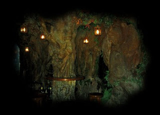

Acabo de ver la famosa película Vicky Cristina Barcelona o como le puso mi hermano, "yo quiero ser como Javier Bardem"...

Obviamente la peli al ser de Woody Allen, es muy loca y con secuencias que por momentos no sabemos si son los personajes los que están locos o somos nosotros...

No les pienso dañar la película, pero lo que me llamó la atención desde el principio son los escenarios, los fondos... La mayor parte de la película se desarrolla en Barcelona, esa ciudad que está llena de arte y de locura por todos lados, que tiene sus callejuelas diminutas escondidas en el barrio gótico... En fin, es una ciudad que me encanta, llena de bohemia y de historias...

Se suponía que de acuerdo a mis planes este año estaría haciendo una maestría en Barcelona, no estaría sólo, sino compartido con alguien más y recorriendo viejos y nuevos lugares... Al final nada de eso pasó, pero igual me muero de las ganas de volver a pisar Europa o al menos como mínimo Barcelona, por ahora estoy reorganizándome para poder lograrlo, quizá ya no estudie, pero igual sería bueno ir al menos a hacer un poco de turismo, epa y que tengo pendiente una visita a Valladolid :P

PD: Lo que ven en la foto es el "Bosc de les Fades" o el Bosque de las Hadas, un bar que está cerca de las Ramblas, junto a la entrada del museo de cera en Barcelona, es increíble, es como una cueva con toda la decoración tal y como la ven allí, muy inusual.